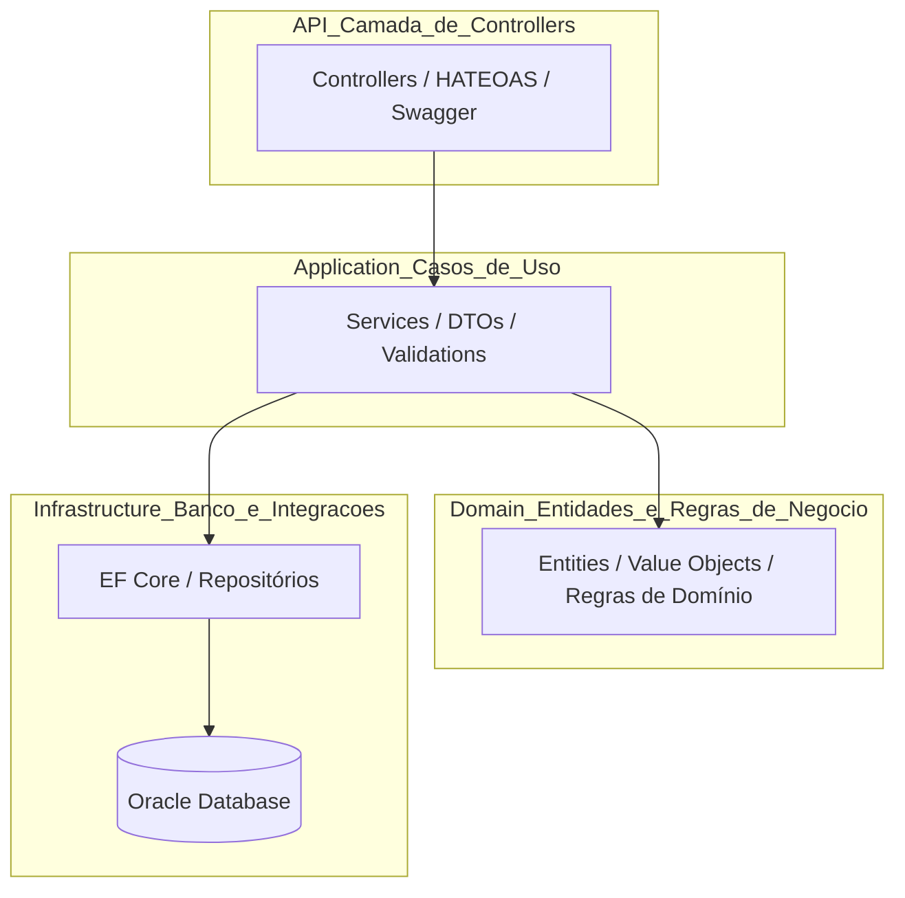

# 🍽️ Sistema de Atendimentos de Restaurante

Este projeto é uma **API RESTful desenvolvida em .NET 8** para o gerenciamento completo de atendimentos em um restaurante, incluindo controle de **mesas, garçons, comandas e clientes**.  
O objetivo é oferecer uma base sólida e escalável para sistemas de gestão de atendimento, integrando **banco de dados Oracle** e aplicando **Clean Architecture** com **boas práticas de desenvolvimento .NET**.

---

## 🧭 Índice

1. [🎯 Objetivo e Escopo](#-objetivo-e-escopo)  
2. [🧩 Visão Geral e Arquitetura](#-visão-geral-e-arquitetura)  
3. [⚙️ Tecnologias Utilizadas](#️-tecnologias-utilizadas)  
4. [📋 Requisitos do Sistema](#-requisitos-do-sistema)  
5. [🏗️ Estrutura do Projeto](#️-estrutura-do-projeto)  
6. [🗃️ Entidades Principais](#️-entidades-principais)  
7. [🚀 Configuração e Execução](#-configuração-e-execução)  
8. [🧱 Migrations e Banco de Dados](#-migrations-e-banco-de-dados)  
9. [🌐 Endpoints Principais (Swagger)](#-endpoints-principais-swagger)  
10. [💾 Exemplos de Uso (Swagger)](#-exemplos-de-uso-swagger)  
11. [🔗 Implementações Avançadas (HATEOAS e Search)](#-implementações-avançadas-hateoas-e-search)  
12. [🧠 Regras de Negócio Implementadas](#-regras-de-negócio-implementadas)  
13. [👥 Integrantes do Grupo](#-integrantes-do-grupo)  

---

## 🎯 Objetivo e Escopo

O **Sistema de Atendimentos de Restaurante** tem como objetivo digitalizar e automatizar o fluxo de atendimento, desde o cadastro de mesas até o fechamento da comanda.

**Escopo do projeto:**
- Cadastro e gerenciamento de mesas, garçons e clientes.  
- Abertura e fechamento de comandas.  
- Registro de pedidos e cálculo automático do valor total.  
- Persistência em banco de dados Oracle.  
- Exposição de API RESTful documentada via Swagger.  
- Implementação de **HATEOAS** e **rotas de busca com paginação e ordenação**.

---

## 🧩 Visão Geral e Arquitetura

O projeto segue o padrão **Domain-Driven Design (DDD)** e aplica a **Clean Architecture**, garantindo separação de responsabilidades e baixo acoplamento entre camadas.



---

## ⚙️ Tecnologias Utilizadas

| Categoria | Tecnologia |
|------------|-------------|
| Linguagem | **C# (.NET 8)** |
| Framework Web | **ASP.NET Core Web API** |
| ORM | **Entity Framework Core (Oracle Provider)** |
| Banco de Dados | **Oracle Database (FIAP Cloud)** |
| Documentação | **Swagger / Swashbuckle** |
| HATEOAS | **Custom Helper com Links RESTful** |
| Paginação e Filtros | **Linq + Dynamic Sorting Extension** |
| Injeção de Dependência | **Built-in DI** |
| Validação | **DataAnnotations / FluentValidation** |
| Logs | **Serilog** |
| Versionamento | **Git + GitHub** |

---

## 📋 Requisitos do Sistema

### **Requisitos Funcionais**
- RF01 – CRUD completo de mesas, garçons, comandas e clientes.  
- RF02 – Abertura e fechamento de comandas.  
- RF03 – Endpoint `/search` com paginação, ordenação e filtros por nome.  
- RF04 – Respostas enriquecidas com **HATEOAS**.  

### **Requisitos Não Funcionais**
- RNF01 – Clean Architecture.  
- RNF02 – Persistência com EF Core + Oracle.  
- RNF03 – Retornos HTTP padronizados.  
- RNF04 – Documentação via Swagger.  

---

## 🏗️ Estrutura do Projeto

```bash
src/
├── Atendimentos.Api/
│   ├── Controllers/
│   │   ├── ClientesController.cs
│   │   ├── ComandasController.cs
│   │   ├── GarconsController.cs
│   │   └── MesasController.cs
│   ├── Helpers/
│   │   └── HateoasHelper.cs
│   ├── Program.cs
│   └── appsettings.json
│
├── Atendimentos.Application/
│   ├── Services/
│   │   ├── ClienteService.cs
│   │   ├── ComandaService.cs
│   │   ├── GarcomService.cs
│   │   └── MesaService.cs
│   └── DTOs/
│       └── ClienteCreateDto.cs
│
├── Atendimentos.Domain/
│   ├── Entities/
│   │   ├── Cliente.cs
│   │   ├── Comanda.cs
│   │   ├── Garcom.cs
│   │   └── Mesa.cs
│   └── Repositories/
│
└── Atendimentos.Infrastructure/
    ├── Context/
    │   └── AtendimentosDbContext.cs
    ├── Repositories/
    └── Migrations/
```

---

## 🗃️ Entidades Principais

### 👤 Cliente
- `Nome`
- `CPF`
- `Telefone`

### 🧑‍🍳 Garçom
- `Nome`
- `Matricula`
- `Telefone`
- `Ativo`

### 🪑 Mesa
- `Numero`
- `Capacidade`
- `Status`
- `Localizacao`

### 🧾 Comanda
- `MesaId`
- `GarcomId`
- `ClienteId`
- `DataAbertura`
- `DataFechamento`
- `ValorTotal`
- `Status`

---

## 🚀 Configuração e Execução

### 1️⃣ Restaurar dependências
```bash
dotnet restore
```

### 2️⃣ Compilar o projeto
```bash
dotnet build
```

### 3️⃣ Rodar as migrações
```bash
dotnet ef database update --project src/Atendimentos.Infrastructure --startup-project src/Atendimentos.Api
```

### 4️⃣ Executar a API
```bash
dotnet run --project src/Atendimentos.Api
```

Acesse 👉 **[http://localhost:5070/swagger](http://localhost:5070/swagger)**

---

## 🧱 Migrations e Banco de Dados

O projeto utiliza **Entity Framework Core (Oracle Provider)**, com migrações automáticas para versionamento de schema.  
O contexto principal é `AtendimentosDbContext`.

---

## 🌐 Endpoints Principais (Swagger)

| Entidade | Método | Endpoint | Descrição |
|-----------|---------|-----------|------------|
| **Clientes** | `GET` | `/api/clientes` | Lista todos os clientes |
|  | `GET` | `/api/clientes/{id}` | Busca cliente por ID (com links HATEOAS) |
|  | `POST` | `/api/clientes` | Cria cliente |
|  | `GET` | `/api/clientes/search` | Busca clientes com paginação e ordenação |
|  | `DELETE` | `/api/clientes/{id}` | Remove cliente |
| **Garçons** | `GET` | `/api/garcons` | Lista garçons |
| **Mesas** | `GET` | `/api/mesas` | Lista mesas |
| **Comandas** | `POST` | `/api/comandas` | Cria comanda |

---

## 💾 Exemplos de Uso (Swagger)

### 🔹 Criar Cliente
```json
POST /api/clientes
{
  "nome": "Maria Eduarda Araujo Penas",
  "cpf": "12345678900",
  "telefone": "11999998888"
}
```

### 🔹 Buscar Clientes com Paginação
```
GET /api/clientes/search?nome=maria&page=1&pageSize=5&sortBy=Nome&order=asc
```

Exemplo de retorno com **HATEOAS**:
```json
{
  "data": {
    "id": "a5d2c4f8-9a41-4f21-8b77-d07a23bfa0e3",
    "nome": "Maria Eduarda Araujo Penas",
    "cpf": "12345678900",
    "telefone": "11999998888"
  },
  "links": [
    {"rel":"self","href":"/api/clientes/a5d2c4f8-9a41-4f21-8b77-d07a23bfa0e3","method":"GET"},
    {"rel":"update","href":"/api/clientes/a5d2c4f8-9a41-4f21-8b77-d07a23bfa0e3","method":"PUT"},
    {"rel":"delete","href":"/api/clientes/a5d2c4f8-9a41-4f21-8b77-d07a23bfa0e3","method":"DELETE"},
    {"rel":"collection","href":"/api/clientes","method":"GET"}
  ]
}
```

---

## 🔗 Implementações Avançadas (HATEOAS e Search)

### ✅ HATEOAS
- Implementado via classe `HateoasHelper.cs`  
- Cada resposta inclui links RESTful (`self`, `update`, `delete`, `collection`)
- Implementado para `Clientes`, `Garçons`, `Mesas` e `Comandas`

### ✅ Search com Paginação, Filtros e Ordenação
- Endpoint: `/api/{entidade}/search`
- Parâmetros:  
  `nome`, `page`, `pageSize`, `sortBy`, `order`
- Retorno inclui:
  - Lista de itens paginados
  - Total de páginas
  - Links `next`, `prev`, `self`

---

## 🧠 Regras de Negócio Implementadas

- Uma **comanda só pode ser aberta** se a mesa estiver **disponível**.  
- Ao **fechar uma comanda**, a mesa volta a ficar **disponível**.  
- **Garçons inativos** não podem abrir comandas.  
- **Clientes** podem ter múltiplas comandas abertas.  
- Validação via **DTOs + DataAnnotations**.  
- Paginação e ordenação dinâmicas nos endpoints `/search`.  

---

## 👥 Integrantes do Grupo

| Nome | RM | Função |
|-------|-----|--------|
| **Maria Eduarda Araujo Penas** | RM560944 | Desenvolvedora Backend/ Infra |
| **Alane Rocha da Sila** | RM561052 | Desenvolvedora Backend |
| **Anna Beatriz de Araujo Bonfim** | RM559561 | Desenvolvedora Front |

---

## 👩‍💻 Autoria

Desenvolvido por:

- 💻 **Maria Eduarda Araujo Penas**  
- 📧 **eduarda.mpenas@gmail.com**  
- 🐙 **[GitHub: DudaAraujo14](https://github.com/DudaAraujo14)**  

---

## 📚 Orientado para

🎓 **Projeto acadêmico FIAP — Advanced Business Development with .NET**  
🗓️ **Entrega: Novembro / 2025**
